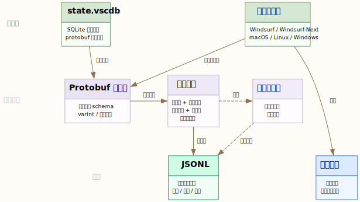

# Windsurf Trajectory Extractor

[English](README.md) | [简体中文](README.zh-CN.md)

通过 protobuf 解码深度提取 Windsurf Cascade 对话历史。

## 功能概述

从 Windsurf 内部存储中提取**完整的轨迹数据**，包括：

- ✅ **Thinking 内容** — 内部推理（仅在 thinking 模式下产生，UI 中不可见）
- ✅ **可见响应** — 用户可见的文本
- ✅ **工具调用** — 完整的参数和结果
- ✅ **微秒级时间戳** — 高精度时间数据
- ✅ **Provider 信息** — 模型提供商（如 "anthropic"）

## 为什么需要这个工具？

Windsurf 将对话历史以 protobuf 编码格式存储在 `state.vscdb` 中。本工具逆向工程了该格式，可以提取标准 UI 导出无法访问的数据。

**核心差异**：与基于 JSON 的提取工具不同，本工具执行**深度 protobuf 解码**，可以访问 thinking 内容和精确时间戳。

## 安装

```bash
# 无需外部依赖 — 纯 Python 标准库
git clone https://github.com/jijiamoer/windsurf-trajectory-extractor.git
cd windsurf-trajectory-extractor

# 使用 uv（推荐）
uv sync
uv run windsurf-trajectory --help

# 或使用 pip
pip install -e .
windsurf-trajectory --help
```

## 使用方法

```bash
# 列出所有包含轨迹数据的工作区
windsurf-trajectory --list

# 按关键词搜索轨迹（自动发现工作区）
windsurf-trajectory --find cascade_solver

# 列出某个工作区的对话摘要
windsurf-trajectory --summaries WORKSPACE_ID

# 提取轨迹到 JSONL
windsurf-trajectory -w WORKSPACE_ID -o trajectory.jsonl
```

## 输出格式 (JSONL)

每行是一个表示单个步骤的 JSON 对象：

```json
{
  "step_id": 15,
  "step_type": 3,
  "timestamp": "2026-03-12T14:30:45.123456+08:00",
  "timestamp_unix_ms": 1741761045123,
  "thinking": "让我分析一下这段代码...",
  "visible": "这是我对代码的分析...",
  "tool_calls": [
    {
      "tool_id": "abc123",
      "tool_name": "read_file",
      "params": {"file_path": "/path/to/file.py"}
    }
  ],
  "provider": "anthropic",
  "content_preview": "这是我对代码的分析..."
}
```

### 字段说明

| 字段 | 说明 |
|------|------|
| `step_id` | 步骤操作码：14=用户消息, 15=AI响应, 21=工具执行 |
| `step_type` | 内部步骤类型（通常为 3） |
| `timestamp` | ISO 8601 时间戳，微秒精度 |
| `timestamp_unix_ms` | Unix 时间戳（毫秒） |
| `thinking` | 内部推理（仅在 thinking 模式下） |
| `visible` | 用户可见的响应文本 |
| `tool_calls` | 工具调用数组，包含参数 |
| `provider` | 模型提供商（如 "anthropic"） |

## 架构



## 技术细节

### 数据位置

```
~/Library/Application Support/Windsurf - Next/User/globalStorage/state.vscdb
```

支持 macOS、Linux 和 Windows 上的 `Windsurf`（稳定版）和 `Windsurf - Next`（预览版）。

### Protobuf 结构（逆向工程）

```
顶层:
  f1 (string): Trajectory UUID
  f2 (message): Steps 容器
    repeated Step:
      f1  (varint): step_id
      f4  (varint): step_type
      f5  (message): metadata {f1: Timestamp {f1=seconds, f2=nanos}}
      f19 (message): 用户消息
      f20 (message): AI 响应
        f3  (string): thinking 内容 ← 仅在 thinking 模式下
        f7  (message): 工具调用 {f1=tool_id, f2=tool_name, f3=params_json}
        f8  (string): 可见响应
        f12 (string): provider
      f28 (message): 工具结果
```

## 限制

- 每个工作区仅提取**活跃轨迹**（最近选中的对话）
- 要提取特定对话，请先在 Windsurf 侧边栏中选中它
- Protobuf 结构可能随 Windsurf 更新而变化

## 使用场景

- **导入到 Nowledge Mem** — 提取对话用于个人知识管理
- **研究** — 分析 AI 编码助手的行为和时序
- **备份** — 导出 UI 无法访问的对话历史
- **调试** — 访问 thinking 内容进行问题排查

## 许可证

MIT

## 相关项目

- [nowledge-mem](https://mem.nowledge.co) — AI Agent 个人记忆系统
- [0xSero/ai-data-extraction](https://github.com/0xSero/ai-data-extraction) — 多工具提取（基于 JSON）

---

**为 [Nowledge 社区](https://github.com/nowledge-co/community) 构建**
